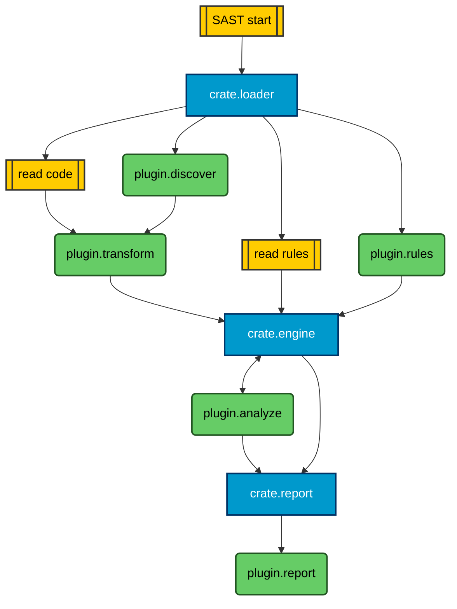

# RootCause Plugins

<div align="center">
  
  
  **Official plugins for RootCause Scanner**
  
  [](https://rootcause.sh)
</div>


This directory contains official plugins that demonstrate the extensibility capabilities of RootCause. Plugins allow you to extend RootCause's functionality with custom discovery, transformation, analysis, reporting, and rule capabilities.

## Capabilities

| Capability | Description |
|------------|-------------|
| `discover` | Find files or resources in the workspace |
| `rules` | Provide additional security rules |
| `transform` | Modify files before analysis |
| `analyze` | Perform custom analysis on files |
| `report` | Generate custom reports from findings |


* **Yellow**: Action
* **Blue**: Core Crate
* **Green**: Plugin

## Plugin Architecture

Each plugin consists of:

- **`plugin.toml`**: Plugin manifest defining capabilities, configuration, and metadata
- **Plugin executable**: The main plugin code (Python, Go, or other supported languages)
- **`README.md`**: Documentation for the specific plugin
- **Additional files**: Dependencies, schemas, or resources as needed

## Plugin Manifest

The `plugin.toml` file defines the plugin's capabilities and configuration:

```toml
name = "example-plugin"
version = "1.0.0"
api_version = "1.0.0"
entry = "plugin.py"
capabilities = ["discover", "transform"]
timeout_ms = 30000
mem_mb = 256
reads_fs = true
needs_content = true
```

## Using Plugins

To use a plugin with RootCause:

```bash
# Use a plugin
rootcause scan ./my-project --plugin ./plugins/report/pdf_report

# Install a plugin for future scans
rootcause plugins install ./plugins/analyze/sca-osv-go

# Configure plugin options
rootcause scan ./my-project --plugin ./plugin --plugin-opt plugin.option=value
```

## Communication Protocol

Plugins communicate with RootCause using JSON-RPC 2.0 over stdin/stdout:

```json
{"jsonrpc": "2.0", "id": "1", "method": "plugin.init", "params": {...}}
{"jsonrpc": "2.0", "id": "2", "method": "repo.discover", "params": {...}}
{"jsonrpc": "2.0", "id": "3", "method": "plugin.shutdown"}
```

## Debugging

For debugging plugins:
- Use `plugin.log` or write to `stderr` for diagnostic messages
- Avoid writing to `stdout` as it's reserved for JSON-RPC communication
- Use structured logging for better integration

For more information on plugin development, see the [RootCause documentation](https://docs.rootcause.sh).
